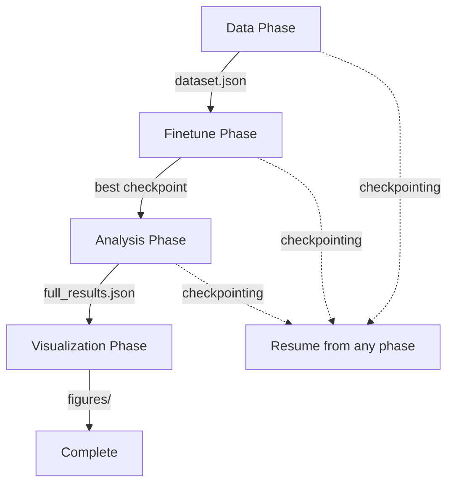

The tool-calling mechanistic interpretability pipeline orchestrates data generation, fine-tuning, analysis, and visualization in a unified workflow. All phases checkpoint their outputs for reproducibility and fault-tolerant resumption.

## Architecture

The pipeline is implemented in `run_pipeline.py` and runs 4 sequential phases:

<Steps>
  <Step title="Data Generation">
    Generate and validate 10,000 confound-balanced synthetic examples
  </Step>
  <Step title="Fine-Tuning">
    Train GPT-2 Small on the tool-calling decision task
  </Step>
  <Step title="Analysis">
    Run activation patching, DLA, SAE analysis, and circuit synthesis
  </Step>
  <Step title="Visualization">
    Generate heatmaps and feature ranking plots
  </Step>
</Steps>

## Phase Flow Diagram



## Running the Full Pipeline

Execute all phases in sequence:

```bash
python run_pipeline.py
```

This runs data generation → fine-tuning → analysis → visualization automatically. Expected runtime: ~5 minutes on RTX 3060 12GB.

## Phase-Specific Execution

Run from a specific phase using `--phase`:

<CodeGroup>
```bash Fine-tune only
python run_pipeline.py --phase finetune
```

```bash Analysis only
python run_pipeline.py --phase analysis
```

```bash Skip visualization
python run_pipeline.py --phase analysis --skip-visualization
```
</CodeGroup>

<Note>
Phase-specific runs require prior phases to have completed. For example, `--phase analysis` requires the fine-tuned checkpoint to exist.
</Note>

## Checkpointing and Resumption

The pipeline saves intermediate outputs at each phase:

| Phase | Checkpoint Location | Resume Command |
|-------|---------------------|----------------|
| Data | `results/data/dataset.json` | `--phase finetune` |
| Finetune | `checkpoints/best/` | `--phase analysis` |
| Analysis | `results/full_results.json` | `--phase visualize` |

### How Resumption Works

From `run_pipeline.py` (lines 308-367):

```python
start_idx = PHASES.index(args.phase)

# Phase 1-2: Data
if start_idx <= 0:
    train_ex, val_ex, test_ex = run_data_phase(logger)
    test_examples = test_ex
    all_examples = train_ex + val_ex + test_ex

# Phase 3: Fine-tuning
checkpoint_path = CONFIG.paths.checkpoint_dir / "best"
if start_idx <= 1:
    if not all_examples:
        # Load from saved dataset
        data_path = CONFIG.paths.data_dir / "dataset.json"
        if not data_path.exists():
            logger.error("No dataset found at %s — run data phase first", data_path)
            sys.exit(1)
        # Reconstruct examples from saved JSON
```

The orchestrator checks for saved artifacts before running each phase. If you run `--phase analysis`, it:
1. Skips data generation (loads `dataset.json` if needed)
2. Skips fine-tuning (uses `checkpoints/best/`)
3. Runs analysis from scratch

## Memory Management

The pipeline is designed for single-GPU operation (RTX 3060 12GB) with aggressive memory management:

```python
from utils.memory_utils import log_memory, clear_gpu_cache

# Between phases
clear_gpu_cache()
log_phase_end(logger, "fine_tuning", {...})
```

Memory is logged at phase transitions:

```
INFO: finetune_start — GPU: 2.7GB / 12GB
INFO: finetune_end — GPU: 0.3GB / 12GB (cleared)
INFO: analysis_start — GPU: 4.1GB / 12GB
```

<Warning>
If you see OOM errors, reduce batch sizes in `configs/experiment_config.py`:
- `TrainConfig.batch_size` (default: 4)
- `AnalysisConfig.patching_batch_size` (default: 10)
</Warning>

## Configuration

All hyperparameters are centralized in `configs/experiment_config.py`:

```python
@dataclass(frozen=True)
class ExperimentConfig:
    data: DataConfig = field(default_factory=DataConfig)
    model: ModelConfig = field(default_factory=ModelConfig)
    train: TrainConfig = field(default_factory=TrainConfig)
    analysis: AnalysisConfig = field(default_factory=AnalysisConfig)
    paths: PathConfig = field(default_factory=PathConfig)
```

### Key Configuration Options

<Accordion title="Data Config">
```python
@dataclass(frozen=True)
class DataConfig:
    n_examples: int = 10_000
    train_ratio: float = 0.80
    val_ratio: float = 0.10
    test_ratio: float = 0.10
    max_seq_len: int = 256
    seed: int = 42
```
</Accordion>

<Accordion title="Training Config">
```python
@dataclass(frozen=True)
class TrainConfig:
    batch_size: int = 4
    gradient_accumulation_steps: int = 4  # effective batch = 16
    epochs: int = 3
    lr: float = 5e-5
    weight_decay: float = 0.01
    warmup_ratio: float = 0.1
    patience: int = 5  # early stopping
```
</Accordion>

<Accordion title="Analysis Config">
```python
@dataclass(frozen=True)
class AnalysisConfig:
    n_patching_pairs: int = 50
    patching_batch_size: int = 10
    sae_top_k_features: int = 20
    ablation_performance_threshold: float = 0.80
```
</Accordion>

## Output Structure

After a complete run, the output directory structure is:

```
results/
├── data/
│   └── dataset.json              # 10k generated examples
├── full_results.json              # Complete analysis results
├── finetune_results.json          # Training metrics
├── figures/
│   ├── patching_heatmap.png       # Activation patching importance
│   ├── dla_heatmap.png            # Direct logit attribution
│   ├── combined_importance.png    # Side-by-side comparison
│   └── sae_feature_ranking.png    # Top SAE features
└── logs/
    ├── pipeline.log               # Main orchestrator logs
    └── trainer.log                # Training loop logs

checkpoints/
└── best/
    ├── model.pt                   # Fine-tuned weights
    ├── tokenizer/                 # Tokenizer with special tokens
    └── metadata.json              # Training metadata
```

## Logging and Monitoring

The pipeline uses structured logging with phase markers:

```python
from utils.logging_utils import log_phase_start, log_phase_end, log_metrics

log_phase_start(logger, "activation_patching")
pairs = generate_patching_pairs(n=CONFIG.analysis.n_patching_pairs)
patching_scores = run_activation_patching(tl_model, pairs, tokenizer)
log_phase_end(logger, "activation_patching", {"max_score": float(patching_scores.max())})
```

Logs are written to `results/logs/pipeline.log`:

```
2026-03-01 14:23:01 - INFO - Starting pipeline from phase 'data'
2026-03-01 14:23:01 - INFO - [PHASE START] data_generation
2026-03-01 14:23:03 - INFO - Generated 10000 examples, validation passed
2026-03-01 14:23:03 - INFO - [PHASE END] data_generation - n_total=10000, n_train=8000
```

## Error Handling

The pipeline validates prerequisites at each phase:

```python
if start_idx <= 2:  # Running analysis
    if not checkpoint_path.exists():
        logger.error("No checkpoint at %s — run finetune phase first", checkpoint_path)
        sys.exit(1)
```

Common errors:

<AccordionGroup>
  <Accordion title="No dataset found">
    **Error**: `No dataset found at results/data/dataset.json`
    
    **Solution**: Run data phase first: `python run_pipeline.py --phase data`
  </Accordion>
  
  <Accordion title="No checkpoint found">
    **Error**: `No checkpoint at checkpoints/best/ — run finetune phase first`
    
    **Solution**: Run fine-tuning: `python run_pipeline.py --phase finetune`
  </Accordion>
  
  <Accordion title="SAE loading failures">
    **Error**: `SAE analysis failed (non-fatal): ...`
    
    **Solution**: This is a warning, not an error. The pipeline continues without SAE analysis. SAE loading requires internet access for pretrained models.
  </Accordion>
</AccordionGroup>

## Reproducibility

All random operations are seeded via `CONFIG.data.seed` and `CONFIG.train.seed`:

```python
# Dataset generation (data/synthetic_generator.py:923)
rng = random.Random(seed)

# Dataset splits (run_pipeline.py:70)
generator = torch.Generator().manual_seed(CONFIG.data.seed)
indices = torch.randperm(n, generator=generator).tolist()
```

Running the same pipeline twice produces identical results (except for GPU non-determinism in some PyTorch ops).

## Next Steps

<CardGroup cols={2}>
  <Card title="Data Generation" icon="database" href="/experiments/data-generation">
    Learn how the synthetic dataset is created
  </Card>
  <Card title="Fine-Tuning" icon="brain" href="/experiments/fine-tuning">
    Understand the training process
  </Card>
  <Card title="Running Analysis" icon="chart-line" href="/experiments/running-analysis">
    Execute interpretability analyses
  </Card>
</CardGroup>