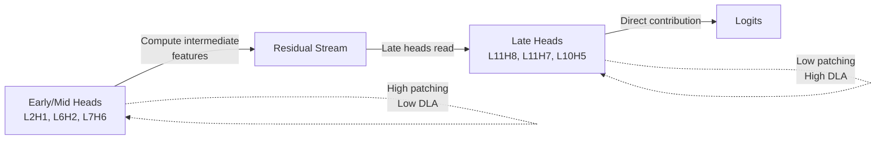

The analysis phase runs activation patching, direct logit attribution (DLA), SAE feature analysis, and circuit synthesis to reverse-engineer the tool-calling decision mechanism. This phase can be run independently after fine-tuning.

## Analysis-Only Mode

Run analysis without re-training:

```bash
python run_pipeline.py --phase analysis
```

<Info>
This requires a fine-tuned checkpoint at `checkpoints/best/`. If it doesn't exist, run fine-tuning first: `python run_pipeline.py --phase finetune`
</Info>

### Headless Execution

Skip visualization in headless environments (e.g., SSH without X11):

```bash
python run_pipeline.py --phase analysis --skip-visualization
```

## Analysis Pipeline

The analysis phase runs 4 complementary techniques:

<Steps>
  <Step title="Activation Patching">
    Measure causal importance of each attention head by swapping activations between tool/no-tool prompts
  </Step>
  
  <Step title="Direct Logit Attribution (DLA)">
    Decompose logit differences into additive contributions from each head and MLP
  </Step>
  
  <Step title="SAE Feature Analysis">
    Identify sparse interpretable features that correlate with tool-calling decisions
  </Step>
  
  <Step title="Circuit Synthesis">
    Combine patching + DLA rankings to identify a minimal circuit, then validate with ablations
  </Step>
</Steps>

## Activation Patching

### What It Measures

**Causal importance**: How much does this head's output matter for the tool-calling decision?

From `analysis/activation_patching.py`:

```python
def run_activation_patching(
    model: HookedTransformer,
    pairs: list[tuple[str, str]],
    tokenizer: PreTrainedTokenizerFast,
    config: ExperimentConfig,
) -> np.ndarray:
    """Run activation patching for all (layer, head) pairs.
    
    For each head:
    1. Run model on tool-needed prompt → baseline logit diff
    2. Run model on tool-not-needed prompt
    3. Patch head output from (2) into (1)
    4. Measure logit diff drop: large drop = causally important
    
    Returns: (n_layers, n_heads) array of patching scores
    """
```

### Algorithm

For each attention head at layer L, head H:

1. **Baseline run**: Compute logit diff on tool-needed prompt
2. **Counterfactual run**: Compute activations on tool-not-needed prompt
3. **Intervention**: Replace head (L, H) output in baseline with counterfactual activations
4. **Score**: `patching_score = baseline_logit_diff - patched_logit_diff`

Large scores indicate the head is causally responsible for the tool-call decision.

### Results Format

Output shape: `(12 layers, 12 heads) = 144 scores`

From `results/full_results.json`:

```json
{
  "patching_scores": [
    [0.000, 0.023, 0.011, ...],  // Layer 0
    [0.041, 0.592, 0.028, ...],  // Layer 1 (L2H1 = 0.592)
    ...
    [0.069, 0.098, 0.303, ...],  // Layer 11 (L11H8 = 0.069)
  ]
}
```

Top heads by patching score:

| Head | Score | Layer Position |
|------|-------|----------------|
| L7H6 | 0.606 | Mid-network |
| L2H1 | 0.592 | Early network |
| L6H2 | 0.559 | Mid-network |

<Note>
Activation patching captures **causal importance**, not direct output contribution. A head can be causally critical without directly writing to the final logits.
</Note>

## Direct Logit Attribution (DLA)

### What It Measures

**Direct contribution**: How much does this head's output directly push the logits toward `<|tool_call|>`?

From `analysis/logit_attribution.py`:

```python
def compute_dla(
    model: HookedTransformer,
    prompts: list[str],
    tokenizer: PreTrainedTokenizerFast,
    config: ExperimentConfig,
) -> dict:
    """Compute direct logit attribution for all heads.
    
    DLA decomposes the logit difference as:
      logit_diff = sum_i (head_i_output @ W_U[:, tool_token] - W_U[:, no_tool_token])
    
    Returns: dict with keys {head_dla: (n_layers, n_heads), mlp_dla: (n_layers,)}
    """
```

### Algorithm

1. Run model forward pass on prompt, cache all attention head outputs
2. For each head, project output through unembedding matrix: `head_output @ W_U`
3. Compute contribution to tool vs no-tool logit: `logit[tool_token] - logit[no_tool_token]`
4. Average over all prompts

DLA is a **linear decomposition** — all head contributions sum to the total logit difference.

### Results Format

From `results/full_results.json`:

```json
{
  "dla_scores": [
    [0.012, 0.062, 0.089, ...],  // Layer 0
    ...
    [2.959, 0.034, 3.404, ..., 13.432],  // Layer 11 (L11H8 = 13.432)
  ]
}
```

Top heads by DLA score:

| Head | Score | Meaning |
|------|-------|----------|
| L11H8 | 13.43 | Dominant direct contributor |
| L10H5 | 6.36 | Late-layer readout |
| L11H7 | 5.23 | Late-layer readout |

<Warning>
DLA measures **correlation**, not causation. A head with high DLA might be reading out decisions made by earlier heads.
</Warning>

## Patching vs DLA: Computation vs Readout

The two methods reveal different roles:



From `RESULTS.md`:

> The heads with the highest patching importance (L7H6, L2H1, L6H2) have relatively low DLA scores — they do not directly push the logits toward a decision. Instead, they compute intermediate features that later heads read and amplify. This computation-readout dissociation persists from the original analysis.

## SAE Feature Analysis

### What It Measures

**Sparse interpretable features**: Which SAE features correlate with tool-calling decisions?

From `analysis/sae_features.py`:

```python
def analyze_layer(
    model: HookedTransformer,
    sae: SparseAutoencoder,
    tool_prompts: list[str],
    no_tool_prompts: list[str],
    tokenizer: PreTrainedTokenizerFast,
    config: ExperimentConfig,
) -> dict:
    """Analyze SAE features at a single layer.
    
    1. Extract activations at target layer for tool/no-tool prompts
    2. Encode activations through SAE → sparse feature vectors
    3. Compute Cohen's d effect size for each feature
    4. Return top-k features by |d|
    """
```

### Algorithm

1. **Target layer selection**: Use layer with highest total patching importance
2. **Activation extraction**: Cache residual stream activations at that layer
3. **SAE encoding**: `features = SAE.encode(activations)`
4. **Effect size**: Compute Cohen's d for each feature:
   ```python
   d = (mean_tool - mean_no_tool) / pooled_std
   ```
5. **Ranking**: Sort by `|d|` and return top 20

### Results Format

From `results/full_results.json`:

```json
{
  "top_sae_features": [
    {
      "feature_id": 3633,
      "cohen_d": -19.38,
      "tool_mean": 0.00,
      "no_tool_mean": 11.41,
      "interpretation": "Silent on tool, active on no-tool"
    },
    {
      "feature_id": 15917,
      "cohen_d": -19.02,
      "tool_mean": 0.00,
      "no_tool_mean": 13.51
    },
    ...
  ],
  "sae_layer": 9
}
```

<Info>
**All top 20 features are no-tool-favoring** (negative Cohen's d). The model identifies tool-call by the **absence** of these no-tool features rather than the presence of dedicated tool features.
</Info>

### Causal Validation

Correlational SAE features may not be causally important. Test with interventions:

```bash
python scripts/causal_positive_control.py
```

From `RESULTS.md`:

> All 20 features produce ~0.000 change in model logit difference when patched out individually. The mean baseline logit diff is -0.323, and per-feature interventions remain near that value. [...] This is striking: features with enormous observational effect sizes (d > 19) are completely causally inert.

## Circuit Synthesis

### Identifying the Circuit

Combine patching + DLA rankings via geometric mean:

```python
def identify_circuit_heads(
    patching_scores: np.ndarray,
    dla_scores: np.ndarray,
    top_percentile: float = 0.10,
) -> list[tuple[int, int]]:
    """Select circuit heads via combined ranking.
    
    1. Rank all 144 heads by patching score
    2. Rank all 144 heads by |DLA score|
    3. Compute geometric mean of ranks
    4. Select top 10th percentile (default: 15 heads)
    """
```

This balances causal importance (patching) with direct contribution (DLA).

### Ablation Validation

Test circuit with two ablation experiments:

<Tabs>
  <Tab title="Sufficiency">
    **Question**: Can the circuit heads alone perform the task?
    
    **Method**: Keep only circuit heads (15), zero-ablate all others (129)
    
    **Result**: 50.0% accuracy (chance level)
    
    **Interpretation**: The 15-head circuit is **not sufficient** under aggressive zero-ablation
  </Tab>
  
  <Tab title="Necessity">
    **Question**: Is the circuit necessary for the task?
    
    **Method**: Zero-ablate circuit heads (15), keep all others (129)
    
    **Result**: 100.0% accuracy
    
    **Interpretation**: The 15-head circuit is **near-non-necessary** — the model works perfectly without it
  </Tab>
</Tabs>

From `RESULTS.md`:

> The identified circuit is not sufficient and near-non-necessary for the tool-calling decision. [...] With confound-balanced data, the model's decision mechanism is highly distributed and redundant. No small subset of heads is critical.

### Circuit-Size Sweep

Test how sufficiency/necessity change with circuit size:

```bash
python scripts/circuit_size_sweep.py
```

Results:

| Circuit Size | Sufficiency | Necessity |
|--------------|-------------|------------|
| 15 heads | 0.50 | 1.00 |
| 30 heads | 0.50 | 1.00 |
| 60 heads | 0.86 | 0.55 |
| 100 heads | 0.99 | 0.50 |
| 140 heads | 1.00 | 0.50 |

<Note>
Performance is recovered only when large fractions of heads are retained, supporting a distributed/redundant mechanism.
</Note>

## Output Files

Analysis produces multiple output files:

<AccordionGroup>
  <Accordion title="full_results.json">
    Complete analysis results:
    ```json
    {
      "patching_scores": [[...], ...],
      "dla_scores": [[...], ...],
      "top_sae_features": [...],
      "circuit_heads": [[2, 1], [6, 2], [7, 6], ...],
      "ablation_results": {
        "sufficiency": {"accuracy": 0.50, ...},
        "necessity": {"accuracy": 1.00, ...}
      }
    }
    ```
    Location: `results/full_results.json`
  </Accordion>
  
  <Accordion title="figures/">
    Generated plots:
    - `patching_heatmap.png` — Activation patching importance (12×12 grid)
    - `dla_heatmap.png` — Direct logit attribution (12×12 grid)
    - `combined_importance.png` — Side-by-side comparison
    - `sae_feature_ranking.png` — Top 20 SAE features by Cohen's d
    
    Location: `results/figures/`
  </Accordion>
  
  <Accordion title="deep_analysis_results.json">
    Follow-up analyses (attention patterns, adversarial probing, per-tool-type decomposition):
    ```bash
    python scripts/deep_analysis.py
    ```
    Location: `results/deep_analysis_results.json`
  </Accordion>
</AccordionGroup>

## Follow-Up Scripts

After running main analysis, execute follow-up experiments:

<CodeGroup>
```bash Deep Analysis
python scripts/deep_analysis.py
# Runs: attention patterns, adversarial probing, per-tool-type circuits
```

```bash Causal Controls
python scripts/causal_positive_control.py
# Validates intervention pipeline with known-causal heads
```

```bash Seed Robustness
python scripts/patching_seed_robustness.py
# Tests patching stability across different random seeds
```

```bash Ablation Stress Test
python scripts/ablation_stress_test.py
# Larger-sample ablation (400 examples instead of 30)
```
</CodeGroup>

## Configuration Options

From `configs/experiment_config.py`:

```python
@dataclass(frozen=True)
class AnalysisConfig:
    n_patching_pairs: int = 50       # minimal pairs for activation patching
    patching_batch_size: int = 10    # VRAM management
    sae_repo_id: str = "jbloom/GPT2-Small-SAEs-Reformatted"
    sae_top_k_features: int = 20     # top features to report
    cohen_d_threshold: float = 0.5   # effect size threshold
```

### Adjusting Analysis Scope

<Tabs>
  <Tab title="More Patching Pairs">
    ```python
    class AnalysisConfig:
        n_patching_pairs: int = 100  # default: 50
    ```
    More pairs increase robustness but slow down analysis.
  </Tab>
  
  <Tab title="Different SAE Layer">
    ```python
    # In analysis/sae_features.py, modify target_layer selection:
    target_layer = 6  # instead of argmax(layer_importance)
    ```
  </Tab>
  
  <Tab title="Larger Batch Size">
    ```python
    class AnalysisConfig:
        patching_batch_size: int = 20  # default: 10
    ```
    Larger batches are faster but use more VRAM.
  </Tab>
</Tabs>

## Memory Requirements

Analysis is more memory-intensive than training:

```
INFO: analysis_start — GPU: 0.3GB / 12GB
INFO: model_loaded — GPU: 4.1GB / 12GB
INFO: activation_patching — GPU: 6.8GB / 12GB (peak)
INFO: dla_complete — GPU: 4.5GB / 12GB
INFO: sae_loading — GPU: 7.2GB / 12GB (peak)
```

If you encounter OOM:
1. Reduce `patching_batch_size` to 5
2. Reduce `n_patching_pairs` to 25
3. Skip SAE analysis (it's optional; analysis continues if SAE loading fails)

## Interpreting Results

<Steps>
  <Step title="Check convergence">
    Verify test accuracy ≥ 95% in `results/finetune_results.json`. Low accuracy means the model hasn't learned the task.
  </Step>
  
  <Step title="Identify compute heads">
    Look at patching heatmap: which heads have scores > 0.5? These are causally important.
  </Step>
  
  <Step title="Identify readout heads">
    Look at DLA heatmap: which heads have scores > 5.0? These directly write the decision.
  </Step>
  
  <Step title="Check ablations">
    If sufficiency < 0.80, the circuit is distributed. If necessity > 0.90, the circuit is redundant.
  </Step>
  
  <Step title="Validate with controls">
    Run `causal_positive_control.py` to ensure interventions are working correctly.
  </Step>
</Steps>

## Common Issues

<AccordionGroup>
  <Accordion title="SAE loading fails">
    **Error**: `SAE analysis failed (non-fatal): ...`
    
    **Cause**: Requires internet to download pretrained SAEs from HuggingFace
    
    **Solution**: This is a warning, not an error. Analysis continues without SAE features. For full SAE analysis, ensure internet access.
  </Accordion>
  
  <Accordion title="Low patching scores">
    **Symptom**: All patching scores < 0.1
    
    **Cause**: Model may not have learned the task, or prompts are incorrectly formatted
    
    **Solution**: Check test accuracy in `finetune_results.json`. If < 95%, retrain. If ≥ 95%, check prompt formatting in `activation_patching.py`.
  </Accordion>
  
  <Accordion title="Analysis hangs">
    **Symptom**: Script appears frozen during patching
    
    **Cause**: Large `n_patching_pairs` with small `patching_batch_size`
    
    **Solution**: Reduce `n_patching_pairs` to 25 or increase `patching_batch_size` to 20. Progress bars should show activity.
  </Accordion>
</AccordionGroup>

## Next Steps

<CardGroup cols={2}>
  <Card title="Pipeline Overview" icon="diagram-project" href="/experiments/pipeline-overview">
    Understand how analysis fits into the full pipeline
  </Card>
  <Card title="Data Generation" icon="database" href="/experiments/data-generation">
    Learn about the confound-balanced dataset
  </Card>
</CardGroup>