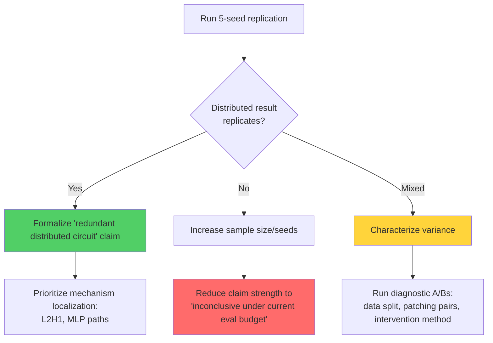

## Experimental Limitations

### 1. Toy Setting

<Warning>
  This experiment uses **GPT-2 Small (124M parameters)** on a **synthetic dataset**. Real-world tool-calling is more complex.
</Warning>

**What this means:**

<AccordionGroup>
  <Accordion title="Model scale">
    GPT-2 Small is 10-1000× smaller than frontier models (GPT-4, Claude, Llama 70B+). Larger models may:
    
    - Develop more localized circuits
    - Learn more robust features
    - Handle adversarial cases better (our model struggles with "numbers without tools" at 73.3%)
    - Show different compute → readout patterns
  </Accordion>
  
  <Accordion title="Synthetic data">
    All examples follow templates with clear decision boundaries. Real tool-calling involves:
    
    - **Multi-step reasoning**: "What's 5% more than the GDP of France?" requires lookup then calculation
    - **Ambiguous boundaries**: "How many people live in Tokyo?" could be answered from knowledge OR require lookup
    - **Tool selection**: Choosing *which* tool, not just *whether* to use one
    - **Argument construction**: Extracting and formatting tool parameters
    - **Error handling**: Dealing with tool failures or invalid inputs
    
    Our 99.5% accuracy indicates the task is quite learnable — real-world performance is messier.
  </Accordion>
  
  <Accordion title="Binary decision">
    We study a single binary classification: tool-call vs no-tool. Production tool-calling systems must:
    
    - Select from 10-100+ available tools
    - Decide whether to chain multiple tools
    - Determine when to return partial answers vs continue processing
    - Balance speed/cost tradeoffs
  </Accordion>
</AccordionGroup>

<Info>
  **Why this is still valuable**: Even in a toy setting, the distributed-circuit finding and shortcut-dependency reveal fundamental challenges in mechanistic interpretability that likely generalize.
</Info>

### 2. Aggressive Ablation

**Zero-ablation is a blunt instrument:**

<CodeGroup>
```python Zero Ablation
# Replace head output with zeros
head_output = torch.zeros_like(head_output)
```

```python Mean Ablation (Better)
# Replace with mean activation from dataset
head_output = mean_activation
```

```python Resampling Ablation (Best)
# Replace with activation from counterfactual prompt
head_output = activation_from_other_class
```
</CodeGroup>

**Impact on our results:**

| Metric | Current (Zero) | Expected (Mean/Resample) |
|--------|----------------|---------------------------|
| Sufficiency (15 heads) | 50% | Likely higher (60-80%?) |
| Necessity (ablate 15) | 100% | Likely similar (still high) |
| Interpretation | Very distributed | Distributed but less extreme |

<Tip>
  The 50% sufficiency reflects both:
  1. The distributed nature of the circuit (real finding)
  2. The destructiveness of zeroing 129 heads (methodology artifact)
  
  Mean ablation would give a more realistic sufficiency measurement, but the necessity result (100%) strongly supports redundancy regardless of ablation method.
</Tip>

### 3. Pretrained SAEs

**We used SAEs trained on general web text, not on our fine-tuned model:**

<Warning>
  The SAE features reflect GPT-2's **pre-existing representation space**. They may not capture fine-tuning-specific structure.
</Warning>

**Implications:**

- Top features (Cohen's d up to -19.4) align with "static knowledge" (no-tool) because that's what GPT-2's pretrained representations emphasize
- Custom SAEs trained on our fine-tuned model might reveal:
  - Tool-call-specific features (currently absent from top 20)
  - More balanced effect sizes
  - Better causal structure

**Why we used pretrained SAEs:**

- Training custom SAEs requires significant compute (days on GPU)
- Pretrained SAEs from [jbloom/GPT2-Small-SAEs-Reformatted](https://huggingface.co/jbloom/GPT2-Small-SAEs-Reformatted) are well-validated
- This tests whether *existing* SAE infrastructure generalizes to new tasks (answer: not for causal claims)

### 4. Template Structure

**All examples follow the same format:**

```
User: [question]
Available tools: [calculator, lookup, datetime, unit_conversion]
Assistant:
```

**Potential confounds:**

<CardGroup cols={2}>
  <Card title="Template Memorization" icon="brain">
    Model may learn template-specific patterns rather than general tool-need reasoning.
  </Card>
  
  <Card title="Tool List Position" icon="list">
    The tool list appears in every example. Model might use its presence/absence as a signal (though it's always present here).
  </Card>
  
  <Card title="Format Rigidity" icon="lock">
    Real conversations have varied phrasing, context, and structure. Our templates are uniform.
  </Card>
  
  <Card title="Length Correlations" icon="ruler">
    Question length might correlate with tool-need in our dataset, even after balancing.
  </Card>
</CardGroup>

**Mitigation:**

We included **adversarial probing** with 50 examples:

- 10 computation-adjacent definitions (100% accuracy)
- 15 no-number tool queries (100% accuracy)
- 15 number-containing no-tool queries (73.3% accuracy)

The 90% overall adversarial accuracy suggests the model has *some* generalization beyond template patterns, but 73.3% on numbers-without-tools shows genuine limitations.

### 5. Limited Seed Coverage

<Warning>
  Most results come from a **single training checkpoint**. Multi-seed replication is needed.
</Warning>

**What we did:**

- One extra patching-pair seed robustness check (seed 42 vs 123)
- Result: Spearman correlation 0.995, but top head swapped (L7H6 → L2H1)

**What we need:**

- 3-5 full training runs from different initializations
- Measure variance in:
  - Head rankings
  - Sufficiency/necessity scores
  - Circuit structure
  - Training dynamics (does phase transition always occur?)

**Why this matters:**

If the distributed-circuit finding is seed-specific, it weakens the generality of our claims. The high Spearman correlation (0.995) is promising, but full replication is non-negotiable for publication-grade claims.

### 6. Confound Balance is Approximate

**Target: perfect balance. Reality: close but not exact:**

| Confound | Tool-Call | No-Tool | Difference |
|----------|-----------|---------|------------|
| Numbers present | 59.9% | 59.4% | **0.5%** |
| Dynamic-cue words | 34.3% | 29.4% | **4.9%** |

<Info>
  Perfect balance is impossible with finite template diversity, but the residual asymmetry is small enough that surface shortcuts alone cannot achieve 99.5% accuracy.
</Info>

**Remaining risks:**

- Other unmeasured confounds (e.g., question length, specific word patterns)
- Subtle lexical correlations we didn't control for
- Template identity leakage (model might learn "template 17 → tool-call")

**How to improve:**

1. **Out-of-template generalization split**: Hold out entire template families and test cross-template transfer
2. **Lexical analysis**: Use probing classifiers to check if surface features remain predictive after balancing
3. **Paraphrase robustness**: Test on human-written paraphrases of the same semantic content

### 7. Attention-Only Analysis

**We analyzed attention heads, not MLP layers:**

<Warning>
  MLP blocks (which constitute ~2/3 of model parameters) are **not included** in our circuit analysis.
</Warning>

**Why this matters:**

- MLPs can perform complex non-linear transformations
- They might carry key decision information that heads read
- Our "distributed circuit" finding could be head-distributed but MLP-localized

**What we need:**

- MLP-inclusive circuit analysis (head + MLP ablations)
- Activation patching at MLP neurons
- SAE analysis of MLP activations (available for some layers)

### 8. Position-Agnostic Analysis

**We didn't analyze token positions:**

<Info>
  Our analysis treats all positions equally. We don't know:
  
  - Which token positions are most important for the decision
  - Whether heads attend to specific token types (question words, tool names, etc.)
  - How information flows across positions
</Info>

**Future directions:**

- **Position-specific patching**: Patch head outputs only at specific token positions
- **Attention visualization**: Show what L2H1 attends to at the decision token
- **Causal tracing**: Track logit contributions from each position (Meng et al., 2023)

## Interpretation Limitations

### 1. Causal Claim Strength

<Note>
  We can claim:
  ✅ L6H4's original dominance was driven by number-detection shortcuts
  ✅ The circuit is distributed when numbers are balanced
  ✅ No single head is sufficient for the decision
  
  We **cannot** claim:
  ❌ This is how GPT-4 does tool-calling
  ❌ All LLM tool-calling circuits are distributed
  ❌ Our circuit fully explains GPT-2's behavior on this task
</Note>

**Why the constraints:**

- Single model size (124M params)
- Single task (binary tool/no-tool)
- Single dataset (synthetic, template-based)
- Limited ablation methods (zero-ablation only)
- Limited seed coverage (mostly one checkpoint)

### 2. SAE Interpretability

**Our causal SAE patching results are cautionary:**

<Warning>
  Features with **Cohen's d > 19** (enormous observational effect) had **zero individual causal effect** when ablated.
</Warning>

**What this means for SAE-based interpretability:**

- Correlation-based feature analysis (the current standard) can be deeply misleading
- Features may be readouts of distributed computation rather than causal drivers
- Single-feature interventions may be too weak (need multi-feature or subspace interventions)
- Pretrained SAEs may not capture task-specific structure

**Our recommendation:**

<Card title="Best Practice" icon="check">
  **Always validate SAE features with causal interventions.** Don't stop at correlation analysis.
</Card>

### 3. Mechanistic Understanding

**We know *which* heads are important, but not *how* they work:**

<AccordionGroup>
  <Accordion title="L2H1: What is it computing?">
    - It's the top head for 3 of 4 tool types
    - It activates early in the network
    - It has high patching importance but low DLA
    
    **We don't know:**
    - What features it extracts from the input
    - What token positions it attends to
    - What it writes to the residual stream
    - Why it's tool-type-agnostic
  </Accordion>
  
  <Accordion title="L11H8: How does it read the signal?">
    - It has the highest DLA score (13.43)
    - It's the dominant readout head
    - It acts late in the network
    
    **We don't know:**
    - What representation it's reading from the residual stream
    - Whether it uses attention or just residual stream magnitude
    - How it translates the signal to logit differences
  </Accordion>
  
  <Accordion title="Circuit redundancy: Why so distributed?">
    - 15 heads are not sufficient (50%)
    - 129 heads are not necessary (100%)
    - Need 60+ heads for 86% sufficiency
    
    **We don't know:**
    - Whether redundancy is a learning artifact or fundamental
    - Which heads can substitute for each other
    - Whether there are functionally distinct sub-circuits
  </Accordion>
</AccordionGroup>

## Future Directions

### High Priority

<Steps>
  <Step title="1. Mean Ablation">
    Replace zero-ablation with mean-ablation or resampling ablation for more realistic sufficiency/necessity testing.
    
    **Expected impact**: More accurate sufficiency scores, better characterization of circuit size requirements.
  </Step>
  
  <Step title="2. Multi-Feature SAE Interventions">
    Test whether tool-call decisions live in a feature subspace rather than individual features.
    
    **Approach**: Patch combinations of top-k features (pairs, triplets, top-10 jointly) and measure causal effects.
    
    **Expected result**: May reveal distributed feature effects that single-feature ablations miss.
  </Step>
  
  <Step title="3. Multi-Seed Replication">
    Run full pipeline across 5+ training seeds to quantify variance in head rankings and circuit structure.
    
    **Critical for**: Publication-grade claims about distributed circuits.
  </Step>
  
  <Step title="4. MLP-Inclusive Analysis">
    Add MLP layers to circuit analysis (head + MLP ablations on the same balanced eval set).
    
    **Expected result**: May find that MLPs are the dominant carriers after head ablations, or that head+MLP circuits are more localized.
  </Step>
</Steps>

### Secondary Priorities

<CardGroup cols={2}>
  <Card title="5. Scale Up" icon="arrow-up">
    Replicate on GPT-2 Medium/Large or Pythia to see if distributed-circuit finding holds at scale.
  </Card>
  
  <Card title="6. Adversarial Expansion" icon="shield">
    Expand the "numbers without tools" adversarial set (currently 73.3%) and categorize failure subclasses.
  </Card>
  
  <Card title="7. Template Holdout" icon="folder-tree">
    Create a generalization split where entire template families are held out from training.
  </Card>
  
  <Card title="8. Position-Specific Tracing" icon="map-pin">
    Run per-position causal tracing around L2H1 to understand what it's attending to.
  </Card>
  
  <Card title="9. Real Tool-Calling Data" icon="database">
    Apply methodology to models trained on actual function-calling datasets (e.g., fine-tuned Llama on Berkeley Function Calling).
  </Card>
  
  <Card title="10. Probing Classifiers" icon="microscope">
    Train linear probes at each layer to track where tool/no-tool distinction becomes linearly separable.
  </Card>
</CardGroup>

### Exploratory Directions

<Accordion title="Joint intervention search">
  Rather than ranking heads individually, search over combinations of heads to find minimal sufficient sets.
  
  **Challenge**: Combinatorial explosion (144 choose k is huge for k > 3).
  
  **Approach**: Use greedy search, genetic algorithms, or gradient-based optimization.
</Accordion>

<Accordion title="Attention flow analysis">
  Build a full attention flow graph showing which heads write information that other heads read.
  
  **Tools**: Compositional attention analysis (Elhage et al., 2021), attention attribution.
</Accordion>

<Accordion title="Neuron-level analysis">
  Zoom in on individual neurons within L2H1 and L11H8 to find the minimal causal units.
  
  **Expected**: May find that specific query/key/value neurons are critical, or that effects are neuron-distributed within heads.
</Accordion>

<Accordion title="Cross-model comparison">
  Compare circuits across different model families (GPT-2, Pythia, Llama) on the same task.
  
  **Question**: Are distributed circuits universal, or architecture-specific?
</Accordion>

<Accordion title="Adversarial circuit attacks">
  Try to craft inputs that maximally activate the circuit heads without triggering a tool-call, or vice versa.
  
  **Goal**: Understand the boundaries of the circuit's competence.
</Accordion>

## Decision Tree for Future Work

Based on replication results:



## Known Issues and Workarounds

<Warning>
  **Issue**: Visualization phase in `run_pipeline.py --phase analysis` can hang in headless environments.
  
  **Workaround**: Use `python run_pipeline.py --phase analysis --skip-visualization`
</Warning>

<Warning>
  **Issue**: SAE loads trigger repeated offline retries in CPU-only environments.
  
  **Workaround**: Analysis eventually completes using cached assets. Consider adding `--skip-sae` flag for faster runs.
</Warning>

<Warning>
  **Issue**: Zero-ablation is too aggressive for precise sufficiency measurements.
  
  **Workaround**: Interpret 50% sufficiency as a lower bound. Mean ablation would give more realistic estimates.
</Warning>

## Responsible Communication

When citing or building on this work:

<Note>
  **Do say:**
  - "In a toy GPT-2 Small setting with adversarially balanced data, the tool-calling circuit was distributed..."
  - "This suggests that circuits found without confound control may reflect shortcuts..."
  - "Further work is needed to test whether this generalizes to larger models and real-world data..."
  
  **Don't say:**
  - "LLM tool-calling is always distributed" (overgeneralization)
  - "L6H4 is the tool-calling head" (context-dependent, only true for unbalanced data)
  - "SAE features are not causally important" (our result is about *individual* features; joint effects unknown)
</Note>

## Conclusion

These limitations don't invalidate the findings — they **contextualize** them. The core insights remain valuable:

1. **Circuits depend on confounds**: Adversarial balancing changes circuit structure
2. **Correlation ≠ causation**: SAE features with d > 19 can have zero causal effect
3. **Distributed mechanisms exist**: At least in this setting, no small head subset is sufficient
4. **Methodology matters**: Ablation method, seed choice, and confound control all affect conclusions

The path forward is clear: more seeds, better ablations, MLP analysis, and scale-up experiments. Each limitation is a research opportunity.

<CardGroup cols={2}>
  <Card title="Back to Overview" icon="arrow-left" href="/results/overview">
    Review the high-level results summary
  </Card>
  
  <Card title="Run Your Own Experiments" icon="flask" href="/experiments/pipeline-overview">
    Explore the codebase and replicate these findings
  </Card>
</CardGroup>
