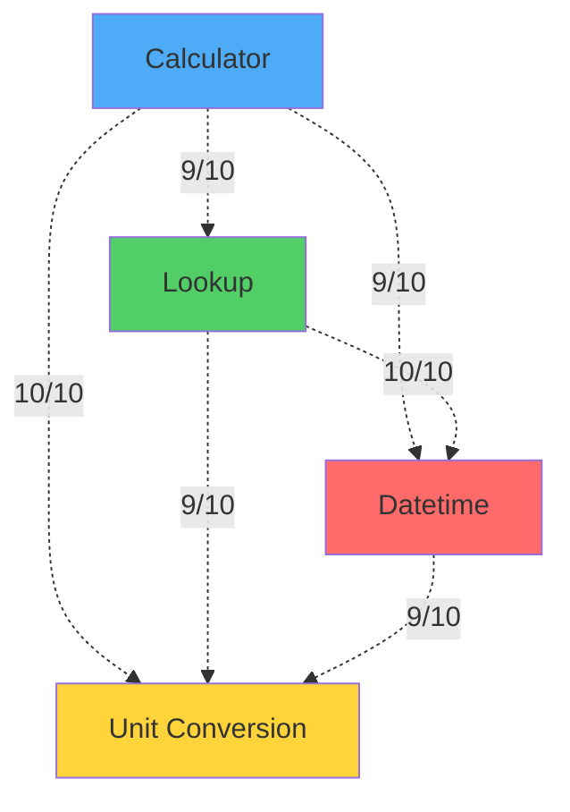

## Activation Patching Heatmap

The activation patching heatmap shows the **causal importance** of each attention head.

### How to Read It

<Note>
  When you run the pipeline with visualization enabled, this generates a 12×12 heatmap showing activation patching scores for each attention head. The file is saved to `results/figures/patching_heatmap.png`.
</Note>

**Structure:**
- **X-axis**: Head number (0-11)
- **Y-axis**: Layer number (0-11)
- **Color intensity**: Patching score (darker = more important)
- **Each cell**: One attention head

**Interpretation:**

<Steps>
  <Step title="Identify hot spots">
    Darker cells indicate heads that are **causally important** for the tool-calling decision. When you swap this head's output between a tool-needed and no-tool prompt, the model's prediction changes significantly.
  </Step>
  
  <Step title="Look for concentration patterns">
    - **Localized circuit**: Hot spots concentrated in a few heads
    - **Distributed circuit**: Heat spread across many heads (our finding)
  </Step>
  
  <Step title="Note layer distribution">
    - **Early layers (L0-L3)**: Input processing, feature extraction
    - **Mid layers (L4-L8)**: Core computation
    - **Late layers (L9-L11)**: Output readout
  </Step>
</Steps>

### Key Observations

In our balanced dataset:

<CardGroup cols={2}>
  <Card title="Distributed Pattern" icon="network-wired">
    Heat is spread across L2, L4-L7, L9-L11. No single dominant cell.
  </Card>
  
  <Card title="No L6H4 Dominance" icon="circle-xmark">
    L6H4 (originally dominant) now shows near-zero activation — evidence of shortcut removal.
  </Card>
  
  <Card title="Early-Layer Signal" icon="arrow-up">
    L2H1 is bright (score 0.592), indicating early feature extraction is critical.
  </Card>
  
  <Card title="Flat Distribution" icon="equals">
    Max score is only 0.606 — top heads are within 8% of each other.
  </Card>
</CardGroup>

<Tip>
  **Compare to original**: In the unbalanced dataset, you'd see a single blazing cell at L6H4 (score 4.28). The balanced heatmap looks much "cooler" and more uniform.
</Tip>

## DLA (Direct Logit Attribution) Heatmap

The DLA heatmap shows which heads **directly write** to the tool-call decision logit.

### How to Read It

<Note>
  When you run the pipeline with visualization enabled, this generates a 12×12 heatmap showing DLA scores for each attention head. The file is saved to `results/figures/dla_heatmap.png`.
</Note>

**Interpretation:**

<AccordionGroup>
  <Accordion title="What DLA measures">
    DLA decomposes the final logit difference into additive contributions:
    
    ```
    logit_diff = Σ(head_contribution) + Σ(mlp_contribution) + residual
    ```
    
    Each head's contribution is computed by projecting its output through the unembedding matrix:
    
    ```
    contribution = head_output @ W_U[:, tool_token] - W_U[:, no_tool_token]
    ```
  </Accordion>
  
  <Accordion title="High DLA score means...">
    The head **directly pushes the logits** toward the tool-call decision. It's the final step in the computation.
  </Accordion>
  
  <Accordion title="Low DLA score means...">
    The head may still be causally important (high patching), but it computes **intermediate features** that other heads read.
  </Accordion>
</AccordionGroup>

### Key Observations

<Info>
  **Late-layer concentration**: The brightest cells are in **L10-L11** (especially L11H8 with DLA score 13.43). These heads act as **readout heads** that translate the circuit's computation into the final answer.
</Info>

**Dissociation from patching:**

| Head | Patching (Rank) | DLA (Rank) | Role |
|------|-----------------|------------|------|
| L7H6 | 0.606 (#1) | 0.202 (~#50) | **Compute** |
| L2H1 | 0.592 (#2) | 0.062 (~#100) | **Compute** |
| L11H8 | 0.069 (#15) | 13.43 (#1) | **Readout** |
| L10H5 | 0.244 (#10) | 6.36 (#2) | **Readout** |

<Warning>
  **Critical insight**: The heads that matter most for the *decision* (patching) are NOT the heads that directly *write* the answer (DLA). This is evidence of a **two-stage compute → readout architecture**.
</Warning>

## Combined Importance View

When viewed side by side, the two heatmaps reveal the processing pipeline:

<Note>
  The pipeline generates a combined visualization showing both patching and DLA heatmaps side by side. This is saved to `results/figures/combined_importance.png`.
</Note>

<Steps>
  <Step title="Stage 1: Computation (L2–L7)">
    High patching, low DLA. These heads process the input and write a "needs tool" signal into the residual stream.
    
    **Example**: L2H1, L6H2, L7H6
  </Step>
  
  <Step title="Stage 2: Readout (L9–L11)">
    Low patching, high DLA. These heads read the signal and translate it into logit differences.
    
    **Example**: L11H8, L11H7, L10H5
  </Step>
</Steps>

## SAE Feature Ranking

The SAE feature ranking plot shows which features are most correlated with tool-call decisions.

<Note>
  When you run the pipeline with visualization enabled, this generates a bar chart showing the top 20 SAE features ranked by Cohen's d effect size. The file is saved to `results/figures/sae_feature_ranking.png`.
</Note>

### How to Read It

**X-axis**: Feature ID (0–24,576)
**Y-axis**: Cohen's d effect size
**Bars**: Top 20 features by effect size

<CodeGroup>
```python Cohen's d Formula
cohen_d = (mean_tool - mean_no_tool) / pooled_std
```

```python Interpretation
# Positive d: feature activates more on tool-call examples
# Negative d: feature activates more on no-tool examples
# Magnitude: strength of correlation
```
</CodeGroup>

### Key Observations

<Card title="All Negative" icon="minus">
  **All 20 top features have negative Cohen's d** (range: -12.2 to -19.4). They activate strongly on no-tool examples and are nearly silent on tool-call examples.
</Card>

**Top 3 features:**

| Feature | Cohen's d | Tool Mean | No-Tool Mean | Interpretation |
|---------|-----------|-----------|--------------|----------------|
| 3633 | -19.38 | 0.00 | 11.41 | Pure no-tool detector |
| 15917 | -19.02 | 0.00 | 13.51 | Pure no-tool detector |
| 21369 | -18.45 | 0.00 | 60.69 | Very strong no-tool signal |

<Warning>
  **Misleading correlation**: Despite enormous effect sizes (d > 19), causal patching experiments show these features have **zero individual causal effect** when ablated. They are readouts of residual state, not primary drivers of the decision.
</Warning>

### SAE Interpretation Tips

<Tip>
  When interpreting SAE features:
  
  1. **Don't assume causality**: High correlation ≠ causal importance
  2. **Consider feature interactions**: Effects may be distributed across multiple features
  3. **Use causal interventions**: Always validate with ablation/patching experiments
  4. **Account for SAE basis**: Pretrained SAEs may not align with fine-tuned behavior
</Tip>

## Training Dynamics Plot

The training dynamics plot shows how circuit heads emerge during fine-tuning.

### How to Read It

**X-axis**: Training step (0–1500)
**Y-axis**: Patching score
**Lines**: Individual heads (L2H1, L11H8, L10H5, L5H10, L6H4)
**Background**: Shaded region shows accuracy over time

### Key Observations

<Steps>
  <Step title="Phase Transition (Step 200 → 300)">
    - **Step 200**: Accuracy 60%, all patching scores ≈ 0
    - **Step 300**: Accuracy 96%, multiple heads activate simultaneously
    - **Interpretation**: Circuit "snaps into place" within a single 100-step window
  </Step>
  
  <Step title="L2H1 Dominates from Start">
    Once the circuit emerges (step 300+), L2H1 is consistently the strongest head. Early-layer feature extraction is the bottleneck.
  </Step>
  
  <Step title="L6H4 Stays Marginal">
    L6H4's patching score never exceeds 0.05 throughout training. It's not part of the core circuit with balanced data.
  </Step>
  
  <Step title="Post-Accuracy Fluctuation">
    After accuracy reaches 100% (step 500), patching scores fluctuate rather than grow monotonically. This suggests a distributed computation that doesn't crystallize as neatly as the original circuit.
  </Step>
</Steps>

<Info>
  **Comparison to grokking**: The phase-transition pattern is reminiscent of "grokking" dynamics (Power et al., 2022), but we observe it in a supervised learning setting rather than the typical memorization → generalization transition.
</Info>

## Circuit Ablation Results

### Sufficiency and Necessity

Visual representation of ablation experiments:

<CodeGroup>
```json Full Model
{
  "heads_active": 144,
  "accuracy": "99.5%",
  "interpretation": "Baseline performance"
}
```

```json Sufficiency Test
{
  "heads_active": 15,
  "heads_ablated": 129,
  "accuracy": "50.0%",
  "interpretation": "Circuit alone is NOT sufficient"
}
```

```json Necessity Test
{
  "heads_active": 129,
  "heads_ablated": 15,
  "accuracy": "100.0%",
  "interpretation": "Circuit is near-non-necessary"
}
```
</CodeGroup>

<Frame>
  ```mermaid
  graph LR
    A[Full Model<br/>144 heads<br/>99.5%] --> B[Sufficiency<br/>15 heads<br/>50.0%]
    A --> C[Necessity<br/>129 heads<br/>100.0%]
    
    style B fill:#ff6b6b
    style C fill:#51cf66
  ```
</Frame>

### Circuit Size Sweep

How performance scales with circuit size:

| Heads | Sufficiency | Visual |
|-------|-------------|--------|
| 15 | 50% | ████░░░░░░ |
| 30 | 50% | ████░░░░░░ |
| 60 | 86% | ████████░░ |
| 100 | 99% | █████████░ |
| 140 | 100% | ██████████ |

<Tip>
  **Interpretation**: The mechanism is **highly redundant**. You need 60+ heads (42% of the model) to achieve 86% sufficiency. Small circuits don't capture the behavior.
</Tip>

## Attention Pattern Heatmaps

Attention pattern heatmaps show **what tokens** specific heads attend to.

### How to Read Them

**Rows**: Query positions (tokens in the prompt)
**Columns**: Key positions (tokens being attended to)
**Color intensity**: Attention weight (darker = stronger attention)

### Example: L6H4 Attention Shift

<AccordionGroup>
  <Accordion title="Original (Unbalanced Dataset)">
    L6H4 showed strong attention to number tokens:
    
    - Numbers: **45-60%** of attention mass
    - Other tokens: 40-55%
    - Pattern: Clear number detection
  </Accordion>
  
  <Accordion title="Balanced Dataset">
    L6H4 now attends to generic context:
    
    - Other tokens: **86.9%** (tool) / **93.6%** (no-tool)
    - Numbers: **0.6%** (tool) / **0.2%** (no-tool)
    - Pattern: No number specialization
  </Accordion>
</AccordionGroup>

<Card title="Key Insight" icon="lightbulb">
  When numbers are balanced across classes, L6H4 stops attending to them. Its original behavior was a **surface-feature shortcut**, not genuine tool-need reasoning.
</Card>

## Per-Tool-Type Overlap

Visual representation of circuit overlap across tool types:



<Info>
  **All pairs have 8-10/10 overlap** in their top-10 heads. The model uses a **single unified circuit** for all tool types, not tool-specific sub-circuits.
</Info>

## Best Practices for Visualization Analysis

<CardGroup cols={2}>
  <Card title="Compare Heatmaps" icon="columns">
    Always view patching and DLA heatmaps side by side to understand the compute → readout pipeline.
  </Card>
  
  <Card title="Validate with Ablations" icon="scissors">
    Don't trust correlation alone. Use sufficiency/necessity tests to confirm causal importance.
  </Card>
  
  <Card title="Check Attention Patterns" icon="eye">
    Look at what tokens heads attend to — this reveals whether they're using genuine reasoning or shortcuts.
  </Card>
  
  <Card title="Track Training Dynamics" icon="chart-line">
    Watch how heads emerge during training to understand which computations are learned first.
  </Card>
</CardGroup>

## Common Pitfalls

<Warning>
  **Pitfall 1: Confusing correlation with causation**
  
  High DLA scores or SAE Cohen's d values can be epiphenomenal. Always use causal interventions (patching, ablation) to verify importance.
</Warning>

<Warning>
  **Pitfall 2: Ignoring distributed computation**
  
  Looking for "the head" that does X can miss distributed mechanisms. Check circuit size sweeps to understand redundancy.
</Warning>

<Warning>
  **Pitfall 3: Not checking for shortcuts**
  
  A head can score high on the original task but become irrelevant when confounds are removed (e.g., L6H4). Always test with adversarial examples.
</Warning>

<Warning>
  **Pitfall 4: Over-interpreting single seeds**
  
  Check seed robustness (our Spearman correlation is 0.995). Top heads may swap, but the overall distribution should be stable.
</Warning>

## Next Steps

Now that you understand the visualizations:

<CardGroup cols={2}>
  <Card title="Generate Your Own" icon="code" href="/experiments/running-analysis">
    Run the analysis pipeline to create visualizations for your experiments
  </Card>
  
  <Card title="Understand Limitations" icon="triangle-exclamation" href="/results/limitations">
    Learn about the constraints and caveats of these analyses
  </Card>
</CardGroup>
